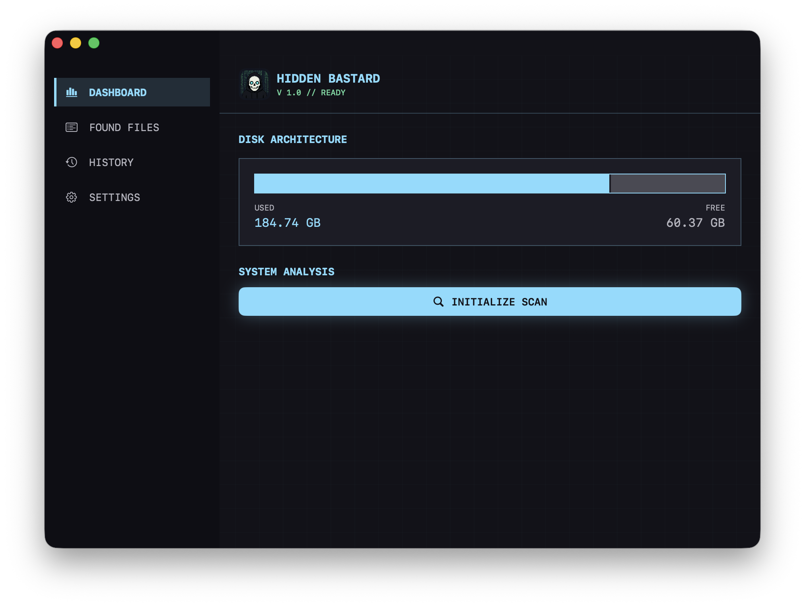
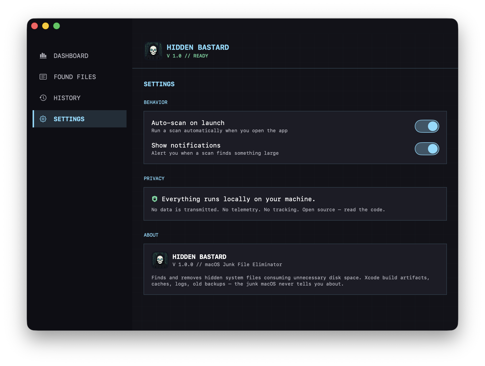

<p align="center">
  
</p>

# Hidden Bastard

**macOS Junk File Eliminator — v1.0**

Free. Open-source. No subscriptions. No telemetry. Built by [MDRN Corp](https://mdrn.app).

[](LICENSE)
[](https://github.com/ghostintheprompt/hidden-bastard/releases)
[](https://github.com/ghostintheprompt/hidden-bastard/releases)

---

## Your Mac is hiding gigabytes of junk from you

macOS creates invisible files everywhere — caches, logs, build artifacts, old iOS backups, Xcode derived data from projects you deleted years ago. The Storage panel won't show you. CleanMyMac wants $40/year to.

**Hidden Bastard finds them. Shows you exactly what they are in plain English. Moves them to Trash.**

One scan freed 20GB on a machine that "had no space to free."

---

## Screenshots




---

## What It Finds

| Category | What it is | Typical size |
|---|---|---|
| **Application Caches** | Browser, app, and system temp files | 2–15 GB |
| **Xcode DerivedData** | Build artifacts from every project you've touched | 10–30 GB |
| **iOS Backups** | Old iPhone/iPad local backups, never auto-deleted | 10–50 GB |
| **System Logs** | Crash reports, diagnostic logs, app logs from years ago | 500 MB–5 GB |
| **Developer Caches** | npm, Yarn, CocoaPods, Gradle, Homebrew downloads | 5–20 GB |
| **Simulator Caches** | Xcode iOS/watchOS simulator data | 5–15 GB |
| **VS Code Storage** | Workspace storage, extension cache, logs | 1–5 GB |
| **Python Envs** | Virtualenvs and pyenv versions that outlived their projects | varies |
| **Incomplete Downloads** | Partial downloads that never finished | varies |
| **Trash** | Files already deleted but not yet freed from disk | varies |

Every result shows a plain-English explanation of what the file is, why it's safe to delete, and how much space it's using.

---

## Installation

### Download (Recommended)

1. Download `HiddenBastard.dmg` from [Releases](https://github.com/ghostintheprompt/hidden-bastard/releases)
2. Open the DMG, drag **Hidden Bastard** to Applications
3. **Right-click → Open** on first launch (required for unsigned apps — normal for open-source tools)
4. Scan

### Homebrew

```bash
brew install --cask hidden-bastard
```

### Build from Source

```bash
git clone https://github.com/ghostintheprompt/hidden-bastard
cd hidden-bastard
xcodebuild -project HiddenBastard.xcodeproj -scheme HiddenBastard -configuration Release build
```

See [BUILD.md](BUILD.md) for full build and signing instructions.

---

## Usage

1. Launch Hidden Bastard
2. Click **INITIALIZE SCAN** — scans all known junk locations
3. Review **FOUND FILES** — each item shows what it is, category, and size
4. Select what to remove (SELECT ALL or pick individually)
5. Click **MOVE TO TRASH** — nothing is permanently deleted without going through Trash first
6. Check **HISTORY** to see everything that's been cleaned

---

## What It Will Never Touch

- Your documents, photos, music, videos
- Application binaries
- Active project files
- System integrity files
- Anything not on the known-safe list

Everything goes to **Trash first** — not permanent delete. You can always undo.

---

## Privacy & Security

Everything runs locally on your machine. No data leaves your computer. No analytics, no tracking, no telemetry. No network calls. Read the code — it's all here.

---

## Building a Release DMG

```bash
./make_dmg.sh 1.0.0
```

Builds a Release `.app`, wraps it in a DMG with an Applications symlink, outputs to `build/HiddenBastard-1.0.0.dmg`. Attach to a GitHub Release.

---

## System Requirements

- macOS 13.0 Ventura or later
- No special permissions required at install — app requests access at scan time

---

## Real-World Results

**Developer (first scan):** 20–70 GB freed — Xcode artifacts, npm caches, old simulator data  
**Casual user:** 3–10 GB — browser cache, app caches, system logs  
**Long-time Mac user:** 50–100 GB — iOS backups from old devices, years of accumulated cache

---

## Why It Exists

macOS Storage Management shows you large files you already know about. It doesn't touch hidden junk. CleanMyMac costs $40/year, is closed source, and upsells constantly.

Hidden Bastard is free, open-source, does one thing, and does it well.

---

## License

MIT — see [LICENSE](LICENSE)

---

Built by **MDRN Corp** — [ghostintheprompt.com](https://ghostintheprompt.com/articles/hidden-bastard)

*Your Mac. Your space. No junk.*
